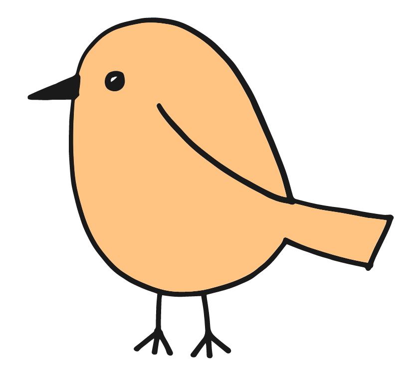

<p align="center"></p>

```
cd ~/.howl/bundles
git clone https://github.com/rokf/howl-chicken
```

You need `chicken-doc` installed for the docs feature to work.

In your `init.lua` file you'll have to overwrite the `ctrl_q` binding.

```
howl.bindings.push {
  editor = {
    ctrl_q = function (editor)
      if howl.app.editor.buffer.mode.name == "elm" then
        howl.command.run('elm-doc')
      elseif howl.app.editor.buffer.mode.name == "chicken" then
        howl.command.run('chicken-doc')
      else
        howl.command.run('show-doc-at-cursor')
      end
    end
  }
}
```

This example also shows why this has to be done. If you'd have multiple bundles changing the binding,
they would overwrite and only one binding would work at time (the last loaded/reloaded one).
